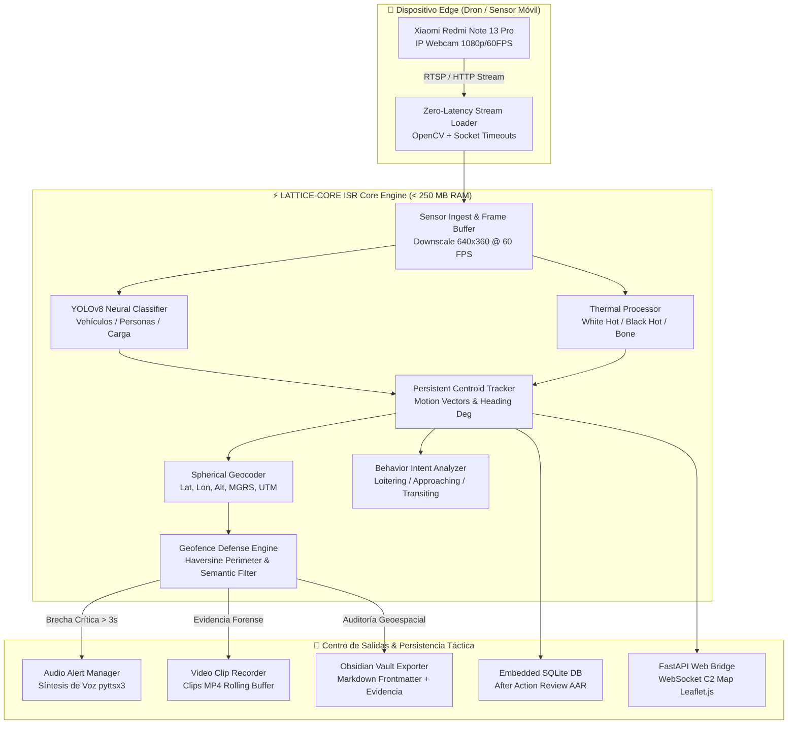

# LATTICE-CORE ISR
## Autonomous Tactical Edge C2, Neural Object Recognition & Geolocation Platform

[](https://python.org)
[](https://opensource.org/licenses/MIT)
[](https://pytest.org)
[](https://pytest.org)
[](https://github.com/psf/black)
[](#)

---

**`LATTICE-CORE ISR`** es una plataforma de software táctico de grado militar diseñada para operar como **Estación de Control Terrestre (GCS)** y **Centro de Mando, Control y Reconocimiento (C2 / ISR)**. 

Ingesta flujos de video RTSP/HTTP desde dispositivos de borde (drones o smartphones como el Xiaomi Redmi Note 13 Pro), ejecuta inferencia de inteligencia artificial multimodal (**YOLOv8**), aplica simulación térmica sintética monocromática, geolocaliza objetivos en cuadrículas **MGRS / UTM**, evalúa perímetros de seguridad defensivos (**Geofencing**) con filtros semánticos y sincroniza auditorías forenses automáticamente en **Obsidian** y bases de datos relacionales embebidas.

---

## 🏛️ Diagrama de Arquitectura del Sistema



---

## ⚡ Características Principales

- 🤖 **Inferencia Neuronal Multiclase YOLOv8:** Identificación táctica instantánea de personas (`person`), vehículos (`car`, `truck`, `bus`, `motorcycle`, `bicycle`) y bultos (`backpack`, `handbag`) con overlay enriquecido: `CLASS CONF% | TRG-ID [THREAT]`.
- 🌐 **Geolocalización Esférica en Tiempo Real:** Proyección de coordenadas geodésicas (WGS84), estimación de altitud, azimut y cuadrícula militar táctica **MGRS** y **UTM**.
- 🛡️ **Geocercas Perimetrales con Filtro Semántico:** Definición de zonas de exclusión (`GEOFENCE_RADIUS_METERS`) con supresión de falsos positivos en objetos inanimados; solo clases críticas activan alertas y reportes.
- 🔊 **Alertas Sintetizadas por Voz en Tiempo Real:** Anuncios audibles automáticos en español vía `pyttsx3` con cooldown dinámico (5.0s) para mitigar la fatiga acústica del operador.
- 🎬 **Videoclips Forenses de Evidencia Automáticos:** Buffer rodante en RAM (3 segundos previos) que genera clips `.mp4` de 5 segundos ante incursiones confirmadas, enlazados en Obsidian.
- 📓 **Bóveda Autónoma Obsidian (Vault):** Exportación out-of-the-box de reportes Markdown enriquecidos con Frontmatter YAML y capturas radiométricas.
- 🗺️ **Dashboard Web C2 con Mapa Táctico:** Interfaz servida en FastAPI + WebSockets protegida por token criptográfico de tiempo constante (`hmac.compare_digest`).
- 🚀 **Rendimiento Militar Optimizado:** Consumo verificado de RAM < 160 MB (con límite en 250 MB) y procesamiento fluido a 60 FPS sin caídas de cuadros.

---

## 🎮 Controles del Operador en Vivo (Hotkeys)

Durante la ejecución en tiempo real del visor táctico:

| Tecla | Acción Táctica |
| :---: | :--- |
| **`D`** | **Alternar Vista de Pantalla:** Cicla entre `RGB_HUD` (Color Real Principal), `THERMAL_HUD` (Térmico Secundario), `SPLIT` (Pantalla Dividida) y `RAW` (Video Directo). |
| **`B`** | **Conmutar Paleta Monocromática:** Alterna entre modos térmicos militares `White Hot`, `Black Hot` y `Bone`. |
| **`S`** | **Instantánea de Reconocimiento:** Genera manualmente una nota de auditoría completa con telemetría GPS/MGRS en Obsidian. |
| **`Q` / `ESC`** | **Cierre Seguro (Clean Shutdown):** Detiene la captura, vacía los buffers de SQLite a disco, finaliza hilos de audio y cierra la sesión. |

---

## 🚀 Instalación y Despliegue Rápido

### Requisitos del Sistema
- Python **3.10** o superior.
- Conexión a red local Wi-Fi con el dispositivo de captura (o cámara web USB).

### 1. Clonar el Repositorio
```bash
git clone https://github.com/tu-usuario/lattice-core-isr.git
cd lattice-core-isr
```

### 2. Crear y Activar Entorno Virtual
En Windows (PowerShell):
```powershell
python -m venv venv
.\venv\Scripts\Activate.ps1
```
En Linux / macOS:
```bash
python3 -m venv venv
source venv/bin/activate
```

### 3. Instalar Dependencias
```bash
pip install -r requirements.txt
```

### 4. Configurar Entorno
```bash
cp .env.example .env
```

### 5. Iniciar la Estación Terrena C2
```powershell
# Iniciar con los parámetros por defecto de .env:
python main.py

# O especificar la URL del sensor Xiaomi IP Webcam directamente:
python main.py http://192.168.1.50:8080/video
```

### 6. Abrir el Mapa Táctico Web
Accede en cualquier navegador a:
```
http://localhost:8000?token=lattice2026
```

---

## 🧪 Ejecución de Tests Automatizados (QA)

La plataforma cuenta con **38 pruebas unitarias y de integración** automatizadas:

```bash
python -m pytest -v
```

```text
============================= test session starts =============================
collected 38 items

tests/test_auth.py ......................... [ 13%]
tests/test_behavior.py .........             [ 18%]
tests/test_db_manager.py .......             [ 23%]
tests/test_geofence.py ..................    [ 36%]
tests/test_geolocator.py ........            [ 42%]
tests/test_health.py ............            [ 47%]
tests/test_multimedia.py ........            [ 52%]
tests/test_pipeline.py ..............        [ 63%]
tests/test_security.py ..................    [ 92%]
tests/test_tracker.py ...........            [100%]

============================= 38 passed in 26.80s =============================
```

---

## 📦 Estructura del Proyecto

```text
soft telemetria/
├── .github/
│   └── workflows/ci.yml         # Pipeline CI/CD GitHub Actions
├── lattice_isr/
│   ├── config/settings.py       # Configuración Pydantic v2
│   ├── core/
│   │   ├── security.py          # Validación anti-SSRF/Path Traversal
│   │   └── stream_loader.py     # Ingesta Zero-Latency 60 FPS
│   ├── engine/
│   │   ├── behavior_analyzer.py # Clasificación de intención táctica
│   │   ├── geofence_engine.py   # Perímetros y filtro semántico
│   │   ├── geolocation_engine.py# Proyección geodésica WGS84/MGRS
│   │   ├── models.py            # Modelos desacoplados de dominio
│   │   ├── object_detector.py   # Inferencia YOLOv8 & HUD monocromo
│   │   ├── target_tracker.py    # Tracker de centroides y vectores
│   │   └── thermal_processor.py # Filtros White/Black Hot CLAHE
│   ├── network/
│   │   ├── security_auth.py     # Autenticación segura de WebSockets
│   │   └── web_bridge.py        # Dashboard C2 FastAPI + Leaflet.js
│   ├── storage/
│   │   ├── db_manager.py        # SQLite embebido asíncrono
│   │   ├── obsidian_exporter.py # Exportador de reportes a Obsidian
│   │   └── video_recorder.py    # Grabador circular de clips MP4
│   └── utils/
│       ├── audio_alert.py       # Síntesis de voz pyttsx3
│       ├── logger.py            # Logging estructurado Loguru
│       └── system_health.py     # Monitor de salud de hardware
├── tests/                       # Suite de 38 pruebas unitarias
├── web_landing/                 # Landing page táctica para GitHub Pages
├── CONTRIBUTING.md              # Guía para colaboradores
├── LICENSE                      # Licencia MIT Open Source
└── main.py                      # Orquestador del Centro de Mando
```

---

## 📄 Licencia

Este proyecto está distribuido bajo la licencia abierta **MIT**. Consulta el archivo [LICENSE](LICENSE) para más detalles.
